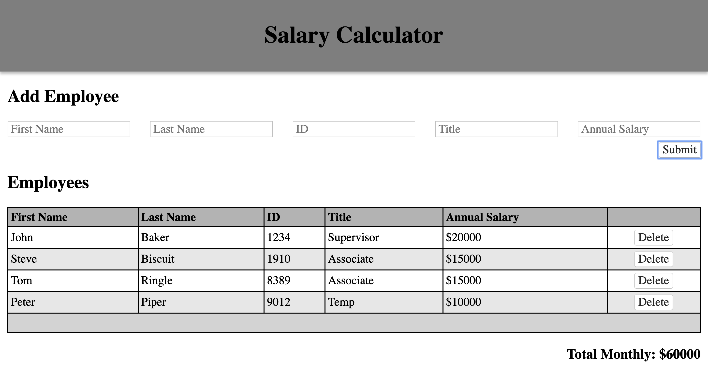

# Salary Calculator

[Project Instructions](./INSTRUCTIONS.md), this line may be removed once you have updated the README.md

## Description

_Duration:_ _Weekend_ _Challenge_

A salary calculator that takes in an employee's details and salary, then displays all the employees in a table and displays a sum of all employee salaries.

## Screen Shot

## Usage

1. Fill out Add Employee fields
2. Submit
3. Click Delete button to remove employee (optional)

## License

[MIT](LICENSE.txt)
